# Funktionen definieren

{{ youtube_video("https://www.youtube.com/embed/OL8OdEm6_hU?si=KoqMvNECuRqKv-6w") }}

Bisher sind alle unsere Codebeispiel so geschrieben, dass dieser einmalig ausgeführt 
wird und dann nicht mehr gebraucht wird. Das ist normalerweise nicht der Fall.
Normalerweise werden Codeabschnitte immer wieder und in verschiedenen Kontexten aufgerufen.
Zum Beispiel wollen wir Code bereitstellen, um den BMI einer Person zu berechnen.
Den Code möchte man einerseits für beliebige Personen ausführen und andererseits an verschiedenen Stellen
(z.B. bei verschiedenen Anzeigen in einer App).

Die wichtigste Möglichkeit zur Strukturierung des Codes sind Funktionen bzw. Methoden.

<div class="grid" markdown>
<div markdown>
In Python ist eine **Funktion** eine selbstständige, wiederverwendbare Codeeinheit, die dazu dient,
**eine bestimmte Aufgabe** zu erledigen. Funktionen können Parameter akzeptieren, 
Operationen durchführen und einen können Rückgabewert liefern.

Beliebte Metaphern, um sie Funktionen vorzustellen sind:

* Eine Funktion, ist eine Maschine, in die wir Argumente stopfen, damit sie diese verarbeitet und uns Ergebnisse liefert.
* Eine Funktion ist wie ein Rezept. Es erwartet bestimmte Zutaten und wenn wir der Anleitung folgen, erhalten wir eine raffinierte Mahlzeit.

```mermaid
graph TD;
    A([Parameter]) --> B[Funktion] --> C([Rückgabewert])
    A1([Zutaten]) --> B1[Rezept] --> C1([Mahlzeit])
    A2([Rohstoffe]) --> B2[Maschine] --> C2([Produkt])
```

</div>


</div>

{{ task(file="tasks/funktionen_identifizieren_1.yaml") }}

Im folgenden Code wird unsere erste eigene Funktion `hoch()` *def*iniert und diese dann drei mal aufgerufen wird:

```{ .python hl_lines="1-3"}
def hoch(): # (1)!
    print("Er lebe...") # (2)!
    print("HOCH!")

hoch() # (3)!
hoch() # (4)!
hoch() # (5)!
```

1. Die Funktion wird it dem Schlüsselwort `def` definiert. Wir geben ihr den Namen `hoch`. Da sie keine Parameter hat schreiben wir hier einfach runde Klammern `()` und danach einen `:` (so wie beim `if`).<br/>Diese Erste Zeile einer Funktion wird **Funktionskopf** genannt.
2. Die nun eingerückten Zeilen sind der **Funktionsrumpf** oder **Funktionskörper**. Diese werden nur durchgeführt, wenn die Funktion aufgerufen wird.
3. Wir führen in dieser Zeile die Funktion aus. Dazu schreiben wir den Funktionsnamen auf, gefolgt von runden Klammern.
4. Wir führen die Funktion erneut aus...
5. Und noch ein drittes mal🥳

{{ python_tutor("""def hoch():
    print('Er lebe...')
    print('HOCH!')

hoch()
hoch()
hoch()""") }}

{{ task(file="tasks/funktionen_ablauf_beschreiben_0.yaml") }}

{{ task(file="tasks/funktionen_schreiben.yaml") }}
