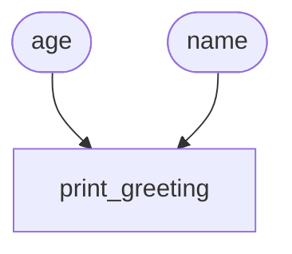

# Funktionen mit Parametern

{{ youtube_video("https://www.youtube.com/embed/PRmoeec5Hko?si=xoR9FszUvp94T4G8") }}

Über Parameter können wir dafür sorgen, dass Funktionen nicht immer exakt das Gleiche tun, sondern, eben abhängig von 
den übergebenen Parametern, in ihren Ergebnissen variieren, obwohl die Rechenvorschriften gleich sind.

Im Bild gesprochen: Ein Rezept besteht einerseits aus einer Liste von Zubereitungsschritten (Funktionskörper)
aber auch aus einer Auflistung der Zutaten (Parameter). Nun kann man zwei verschiedene Kuchen mit demselben Rezept 
backen, indem man die Zutaten variiert. So macht es z.B. einen Unterschied welche konkrete Apfelsorte man in einem
Apfelkuchen verwendet.

Definieren wir Parameter in einer Funktion, so müssen wir diese beim Funktionsaufruf mit Klammern angeben:

<div class="grid" markdown>
<div markdown>

```python
def print_greeting(name, age): # (1)!
    print(f"Hallo {name}!") # (2)!
    if age > 65: # (3)!
        print(f"Geht es?") # (4)! 

print_greeting("Jörg", 68) # (5)!
print_greeting("Kevin", 20) # (6)!
```

1. Bei der Funktionsdefinition werden alle Parameter mit `,` getrennt in die runden Klammern geschrieben.
2. Der erste übergebene Parameter wird hier in der Konsolenausgabe verwendet.
3. Der zweite übergebene Parameter wird hier in der Bedingung benutzt.
4. Auch diese zwei Mal eingerückte Zeile gehört noch zum Funktionsrumpf.
5. Die Funktion wird hier aufgerufen. Die Argumente sind `Jörg` und `#!pyhton 68`, welche für die Paramter `name` und `age` eingesetzt werden.
6. Die Funktion wird hier erneut aufgerufen, aber mit anderen Argumenten. Dies führt zu anderen Konsolenausgaben als bei der ersten Durchführung. 

</div>

<div markdown>

</div>
</div>

{{ python_tutor("""def print_greeting(name, age):
    print(f'Hallo {name}!')
    if age > 65:
        print(f'Geht es?') 

print_greeting('Jörg', 68)
print_greeting('Kevin', 20)""") }}

{{ task(file="tasks/funktionen_schreiben_parameter.yaml") }}
