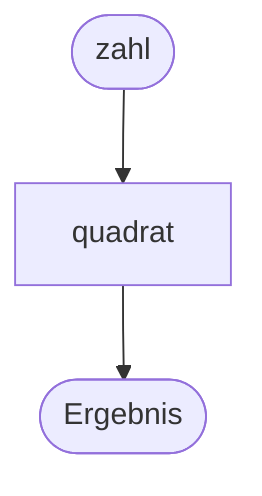

# Rückgabewerte

{{ youtube_video("https://www.youtube.com/embed/pKGjBF3cK9o?si=2P0REHouu_XoMigy") }}

Nun ist noch wichtig zu erwähnen, dass Funktionen nicht nur verarbeiten, sondern auch ein
Ergebnis am Ende ihrer Durchführung zurückgeben können. Der Wert der zurückgegeben werden soll steht in einer
Zeile mit einem vorangehenden `return`.

<div class="grid" markdown>
<div markdown>

```python
def quadrat(zahl): # (1)!
    return zahl * zahl # (2)!

x = 4 # (3)!
q = quadrat(x) # (4)!

print(f"{x}² = {q}") # (5)!
```

1. Beim Funktionskopf sagen wir, dass es einen Paramter gibt. Dass es eine Rückgabe geben wird, lässt sich hier _nicht_ erkennen.
2. Der Parameter `zahl` wird mit sich selbst multipliziert und das Ergebnis dann **zurückgegeben**, da ein `return` am anfang der eingerückten Zeile steht. 
3. Wir speichern in der Variablen `x` das Argument.
4. Wir übergeben `x` an die Funktion und speichern die Rückgabe in der Variablen `q`.
5. Wir geben die Ergebnisse fein säuberlich auf der Konsole aus.

</div>

<div markdown>

</div>
</div>

{{ python_tutor("""def quadrat(zahl):
    return zahl * zahl

x = 4
q = quadrat(x)

print(f'{x}² = {q}')""") }}

{{ task(file="tasks/funktionen_schreiben_rückgabe.yaml") }}

{{ task(file="tasks/funktionen_lesen_komplex.yaml") }}

{{ task(file="tasks/einkaufsladen.yaml") }}