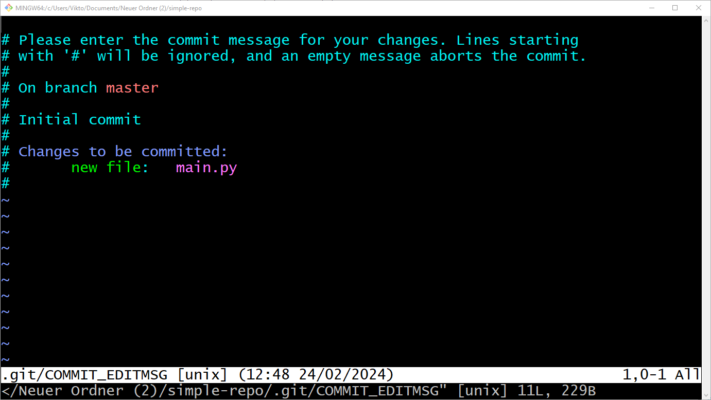
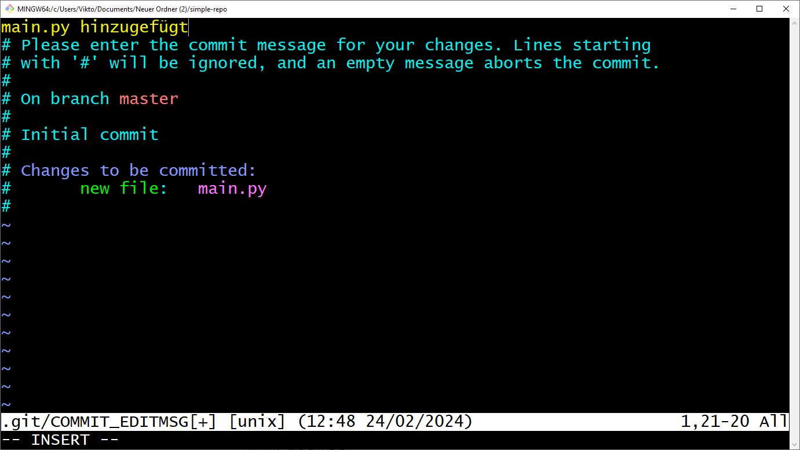
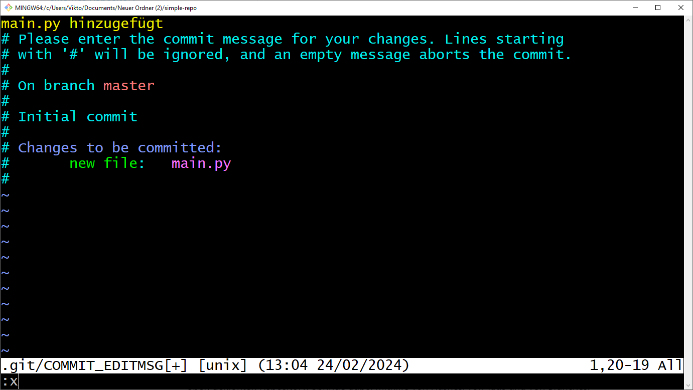
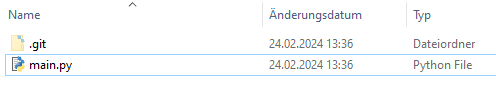
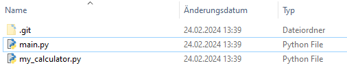
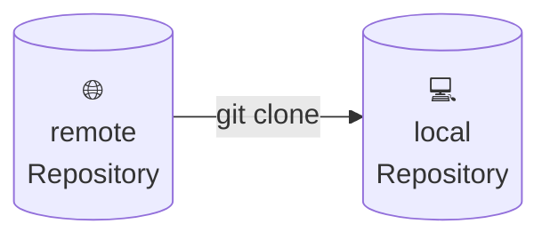

# Einführung in Git: Lokales Arbeiten

### Problem

Stell dir vor, du arbeitest, mit anderen an einem Projekt. Wie arbeitet ihr zusammen?

* Kommunikation über E-Mail (Dateien als Anhänge austauschen).
* Gemeinsames Laufwerk, auf das alle Projektbeteiligten Zugreifen können.
* Paralleles Arbeiten an einer Datei, die in der Cloud liegt, wie mit Google Docs oder Microsoft Word.

{width=50%}


### Lösung: Versionieren mit Git!

Git ist ein Versionsverwaltungssystem, um im Team gemeinsam einfach und sicher an Projekten zu arbeiten.

Git ermöglicht:

- Speicherung, Einsicht und Wiederherstellung von verschiedenen Projektversionen. 
- Eine beliebige Anzahl von Projektversionen.
- Übersicht über alle verschiedenen Projektversionen.
- Die Differenz zwischen zwei Projektversionen ansehen.
- Verschiedene Projektversionen zu einer zusammenführen.
- Neue Projektversionen basierend auf beliebigen alten Projektversionen zu erstellen.
- Nachverfolgbarkeit (Wer erstellte welche Änderung?) mit Begründung.
- Paralleles Arbeiten.
- Einzelnes Arbeiten (ungestört).
- Offline Arbeiten (Unabhängigkeit vom Internet).


## 1. Aufbau von Git:

Ein Projekt wird dabei in einem **Repository** gespeichert. In einem Repository liegen **alle** Versionen
des Projektes vor, die jemals von gespeichert wurden.

Eine einzelne Projektversion wird in einem **Commit** gespeichert. Man kann es sich wie ein Bild vorstellen,
dass man vom Projekt zu einem gewissen Zeitpunkt erstellt hat. Man kann dann immer wieder den Zustand vom Projekt
auf den im Commit festgehaltenen Zustand wieder herstellen. (Man stellt also den Zustand auf dem Bild wieder her.)

Der **Working Tree** ist die Version deines Projektes, die im Moment auf deinem Computer verfügbar ist und
betrachtet und bearbeitet werden kann.

Der **Index/Staging Area** ist eine Datei von git, in der hinterlegt ist, welche Inhalte beim Erstellen eines
neuen Commits tatsächlich gespeichert werden sollen. Bei git müssen nämlich alle Änderungen, die du in einem
Projekt vornimmt auch in einer neuen Projektversion (Commit) gespeichert werden. Es ist nämlich möglich auch nur
bestimmte Änderungen auszuwählen, indem man nur diese der Staging Area hinzufügt. Dann werden auch nur diese 
Änderungen im neuen Commit gespeichert.

Ein **Branch** ist ein Zeiger auf eine Projektversion. Dieser ist nützlich, um bei den vielen Projektversionen
die Übersicht zu behalten, was die aktuellsten Projektversionen sind. Mehr dazu später

{{ task(file='tasks/git_aufgabe_01.yaml') }}

### 1.1 Installation von GIT
Wir können Git auf den gängigsten Betriebssystemen wie Windows, Mac und Linux installieren.
Tatsächlich ist Git auf den meisten Mac- und Linux-Rechnern standardmäßig installiert.

Falls git bei dir nicht installiert ist, folge dieser [Anleitung](https://git-scm.com/book/en/v2/Getting-Started-Installing-Git).

Um zu sehen, ob Git bereits installiert ist, öffnen wir ein Terminal und führen Folgendes aus:

```console
$ git version
git version 2.24.3 (Apple Git-128)
```
Darüber hinaus verfügt Git über integrierte GUI-Tools zum Festschreiben (git-gui)
und Durchsuchen (gitk). Es gibt auch zahlreiche Tools oder IDE-Plugins von Drittanbietern,
die das Arbeiten vereinfachen. Wir lernen es in diesem Kurs aber von Grund auf mit der Konsole zu bedienen.

## 2. Die Konfiguration von GIT
Sobald wir Git installiert haben, können wir es einfach mit dem Befehl `git config` konfigurieren.

```console
$ git config --global user.name "Qualidy User"
```
Mit diesem Befehl legen wir den Nutzernamen fest, der bei allen Commits, die wir Erstellen als Autor hinterlegt
werden soll. Die Option `--global` legt fest, dass diese Option für alle Repositories des aktuellen Nutzers
des Betriebssystems gilt.

Um die Liste der wirksamen Optionen auszugeben, tippen wir:

```console
$ git config -l
user.name=Qualidy User
```

{{ task(file='tasks/git_aufgabe_02.yaml') }}

### 2.1 Lokales Repository erstellen

Um ein neues Repository zu initialisieren, müssen wir den Befehl git init verwenden. 
Es verwandelt das aktuelle Verzeichnis in ein Git-Repository und git beginnt mit der Verfolgung seines Inhalts:

Neuen Ordner erstellen: 
```console
$ mkdir simple-repo
```

In den neuen Ordner wechseln (`cd` steht für "**c**hange **d**irectory"):
```console
$ cd simple-repo
```

Repository erstellen:
```console
$ git init
Initialized empty Git repository in /simple-repo/.git/
```

Git erstellt darin auch ein verstecktes Verzeichnis namens `.git`. In diesem Verzeichnis werden 
alle Objekte und Referenzen gespeichert, die Git im Rahmen unseres Projektverlaufs erstellt und verwendet. 

Im Moment ist dieses Repository noch leer.

## 3. Dateien erstellen und zum speichern markieren


Wir können nun Dateien im Ordner `simple-repo` erstellen. Erstellen wir z.B. die Datei `main.py`:

```python
# my first python program
print("Hallo Welt")

```

Wir können nun mit dem Befehl `git status` sehen, dass git registiert, dass eine neue Datei im Ordner ist,
diese Aber noch nicht versioniert wird:

```commandline
$ git status
On branch master

No commits yet

Untracked files:
  (use "git add <file>..." to include in what will be committed)
        main.py

nothing added to commit but untracked files present (use "git add" to track)
```

Wir können nun sagen, dass wir die Datei in die nächste Version mit aufnehmen wollen, indem wir 
es mit dem Befehl `git add main.py` dem Index hinzufügen. Wenn wir hier keine Rückmeldung erhalten
ist alles gut gelaufen.

Wenn wir dann erneut den Status erfragen, sehen wir nun, dass die Datei dem Index hinzugefügt wurde:

```commandline
$ git status
On branch master

No commits yet

Changes to be committed:
  (use "git rm --cached <file>..." to unstage)
        new file:   main.py
```

### 3.1 Ersten Commit erstellen

Wir können nun eine Versions unseres Projektes speichern, indem wir einen Commit erstellen mit dem Befehl
`git commit`. Wenn wir das tun, landen wir im VIM Editor. Keine Panik🧘‍♀️🧘‍♂️



VIM ist ein ausgefeilter Texteditor, der in der Konsole benutzt werden kann. Wir sind dazu aufgerufen
hier die **Commit-Message** zu notieren. Das ist eine Nachricht, die beschreiben soll, was in dieser Projektversion
neues passiert ist, im Vergleich zu der bisher genutzten Projektversion.

Für uns gibt es bei Vim nur drei wichtige Befehle:

* Drücke `i`, um in den Insert-Modus zu kommen. Das erkennst du daran, dass ganz unten `-- INSERT --` erscheint. Du kannst jetzt im Text schreiben und mit den Pfeiltasten navigieren. Schreibe nun in die erste Zeile deine Commit-Message



* Um den Insert-Modus zu verlassen dürcke `ESC`. Jetzt kannst du den Text nicht mehr bearbeiten.

* Gebe nun `:x` ein, um zu speichern und den Editor zu schließen. 



Wir haben nun den commit erfolgreich erstellt und können diesen mit dem Befehl `git log` untersuchen:
```commandline
$ git log
commit f8e4d3fc8111a78da61a0ed28ec420eb9fb5aeb4 (HEAD -> master)
Author: Viktor Reichert <viktor.reichert@qualidy.de>
Date:   Sat Feb 24 13:04:13 2024 +0100

    main.py hinzugefügt
```

Wir haben nun unsere erste Projektversion erstellt. Wir können diesen Zustand des Projektes zukünftig jederzeit
wiederherstellen.

### 3.2 Weitere Commits erstellen.

Wir können nun weitere Projektversionen erstellen. Dazu fügen wir neue Dateien hinzu oder ändern bestehende.
Immer wenn wir das tun, können wir mit `git status` sehen, welche Änderungen nur im Working-Tree vorliegen
und welche wir mit `git add` bereits dem Index hinzugefügt wurden und so in der nächsten Projektversion (dem nächsten
Commit) dauerhaft persistiert werden.

Wir können z.B. eine neue Datei `my_calculator.py` erstellen:

```python
def multiply_all(my_list):
    product = 1
    for faktor in my_list:
        product *= faktor
    return product

```

Wir können z.B. die Datei `main.py` erweitern:

```python
# my first python program
from my_calculator import multiply_all 

print("Hallo Welt")
print(multiply_all([2,4,5]))
```

Mit `git status` wird uns nun gesagt, dass die neue Datei noch nicht versioniert wird und die zweite Datei 
Modifizierungen aufweist, die noch nicht versioniert werden:

```commandline
$ git status
On branch master
Changes not staged for commit:
  (use "git add <file>..." to update what will be committed)
  (use "git restore <file>..." to discard changes in working directory)
        modified:   main.py

Untracked files:
  (use "git add <file>..." to include in what will be committed)
        my_calculator.py

no changes added to commit (use "git add" and/or "git commit -a")
```

Wir können nun die Änderungen einzeln dem Index hinzufügen, indem wir `git add main.py` und `git add my_calculator.py`
ausführen, oder wir lassen alles auf ein Mal mit dem Befehl `git add .` hinzufügen. Wir sehen dann mit `git status`,
dass die Datein dem Index hinzugefügt wurden:

```commandline
$ git add .
$ git status
On branch master
Changes to be committed:
  (use "git restore --staged <file>..." to unstage)
        modified:   main.py
        new file:   my_calculator.py
```

Wir können nun einen Commit erstellen. Um etwas schneller zu sein und nicht wieder in VIM zu landen, können wir
beim Befehlsaufruf direkt die Commit-Message mit angeben, indem wir das Flag `-m` mit einer Commit-Message
hinzufügen. Etwa so:

```commandline
$ git commit -m "added my_calculator with multiply_all method"
[master 58ea6a4] added my_calculator with multiply_all method
 2 files changed, 8 insertions(+)
 create mode 100644 my_calculator.py
```

Wir sehen nun, dass im `git log` zwei Commit auftauchen:
```commandline
$ git log
commit 58ea6a40de9de9370a47032e3637eaa77273448b (HEAD -> master)
Author: Viktor Reichert <viktor.reichert@qualidy.de>
Date:   Sat Feb 24 13:26:47 2024 +0100

    added my_calculator with multiply_all method

commit f8e4d3fc8111a78da61a0ed28ec420eb9fb5aeb4
Author: Viktor Reichert <viktor.reichert@qualidy.de>
Date:   Sat Feb 24 13:04:13 2024 +0100

    main.py hinzugefügt

```

Mit dem Befehl `git log --all --oneline --graph` kannst du alle Commits in Kurzform sehen, die in diesem Projekt
erstellt wurden. In dieser Ansicht kannst du mit den Pfeiltasten nach oben und unten navigieren und
sie mit der Taste `q` verlassen.

```commandline
$ git log --all --oneline --graph
* 58ea6a4 (HEAD -> master) added my_calculator with multiply_all method
* f8e4d3f main.py hinzugefügt
```

Der Zeiger `HEAD` zeigt uns übrigens an, welche Projektversion wir derzeit als Ausgangspunkt unserer Arbeit betrachten.

## 4. Zwischen Projektversionen/Commits wechseln

Um von einer Projektversion zur anderen zu wechseln, nutzen wir die Befehle `git switch` oder `git checkout`.

Man gibt dann den _Hash_ des Commits an oder einen _Tag_ oder _Branch_, der auf den Commit zeigt.

Der **Hash** eines Commits kann mit dem Befehl `git log` ermittelt werden
und ist die lange Hexadezimalzahl in der ersten Zeile. In unserem Beispiel 
wären das `58ea6a40d...` und `f8e4d3fc...`. Bei `git log --graph --oneline --all` sehen wir
nur den Anfang von diesem Hash. Die ersten vier Zeichen eines Hash genügen normalerweise.

Ein **Tag** ist eine dauerhafte Referenz auf einen Commit, der verwendet wird,
um z.B. Releaseversionen zu kennzeichnen. Hier verwenden wir diese noch nicht.

Ein **Branch** ist auch eine Referenz auf einen Tag, jedoch kann diese im Laufe der Zeit verschiedene
Commits referenzieren. Der einzige Branch, den wir hier bisher vorliegen haben ist `master`.

Wenn wir also auf den ersten Commit wecheln, können wir `git checkout f8e4` verwenden. Wir sehen dann,
dass wir eine Warnung erhalten, dass wir im "'detached HEAD' state" sind, aber das ist erstmal
nicht so schlimm. Wir sehen nämlich auch, dass wir den alten Projektzustand mit nur einer Datei
wiederhergestellt haben.



Wenn wir dann zum aktuellen Projektstand zurückwechseln wollen, dann können wir das 
über den Befehl `git checkout master`. Dann haben wir wieder beide Dateien.



{{ task(file='tasks/git_aufgabe_03.yaml') }}

{{ task(file='tasks/git_aufgabe_04.yaml') }}

{{ task(file='tasks/git_aufgabe_05.yaml') }}


## 5. Was speichert GIT?
Wenn du ein Repository anlegst, wird ein versteckter Ordner `.git` angelegt. In diesem Ordner befindet sich
das Repository. Normalerweise fasst man diesen Ordner niemals an, aber um git zu erlernen, ist es schön zu sehen,
wo was gespeichert wird.

Alle Projektdateien und Ordner, die git speichert, findet man im Ordner `.git/objects`.
Es gibt vier Arten von Objekten in git:

- Blobs (Dateien mit Inhalt)
- Trees (Bildet Ordnerstrukturen ab. Hat Referenzen zu Blobs und Trees)
- Commits (Wird bei einem Commit erstellt, hat verschiedene Metainfos und Referenz zu einem Tree)
- Annotatet Tags (Referenziert eine dauerhaft einen Commit)

Die Dateien sind in gehashter Form gespeichert. 

{{ task(file='tasks/git_aufgabe_06.yaml') }}


## 6. git clone – Kopiere ein externes Repository
Manchmal existiert bereits ein Projekt und wir möchten es auf unseren eigenen Rechner laden
(z.B. um mitzuwirken oder es einfach zu benutzen). 
Zuerst müssen wir das vorhandene Repository lokal herunterladen.

Der Befehl `git clone` kopiert das Repository in ein neues Verzeichnis:

```console
$ git clone https://github.com/eugenp/tutorials.git
Cloning into 'repo'...
```

Wenn der Vorgang abgeschlossen ist, enthält das neu erstellte Verzeichnis alle Dateien, Commits, 
Branches und den Verlauf des Projekts.

Darüber hinaus ist das geklonte Repository bereits konfiguriert und mit der externen Quelle verbunden:



```console
$ cd tutorials
$ git remote -v
origin	https://github.com/eugenp/tutorials.git (fetch)
origin	https://github.com/eugenp/tutorials.git (push)
```

Git verwendet diese links, um weitere Änderungen zu verwalten. Mehr dazu später.


## 7. Git Workflow
Nun können wir die ersten Änderungen vornehmen. Aber bevor wir das tun, schauen wir uns an, 
wie Git diese Änderungen verfolgt.

Unser lokales Repository besteht aus drei verschiedenen Bäumen, die von Git verwaltet werden.

Das erste ist das Arbeitsverzeichnis, das die aktuelle Version der Dateien enthält.

Nachdem wir unsere Änderungen an den Dateien vorgenommen haben, 
können wir die Dateien in den Index verschieben, der als Staging-Bereich fungiert. 
Wir tun dies mit dem Befehl git add. 

Schließlich können wir unsere Änderungen mit dem Befehl „git commit“ anwenden 
und im lokalen Repository speichern. Durch das Festschreiben der Änderungen wird der HEAD 
des Repositorys aktualisiert, der immer auf das letzte von uns vorgenommene Festschreiben verweist.


Diese drei Schritte werden verwendet, um die lokalen Änderungen beizubehalten. 
Aber wie wir wissen, kann das Repository auch eine externe Quelle enthalten. 
Der letzte Schritt besteht darin, beide Repositories zu synchronisieren und unsere Änderungen zu veröffentlichen.


## 8. Änderungen machen
Nachdem wir nun wissen, wie das Tracking-System von Git funktioniert, 
können wir unsere ersten Änderungen an unserem Repository vornehmen.

## 8.1 git status – Aktuelle Änderungen anzeigen
Erstellen wir eine einfache Datei und fügen sie unserem Repository hinzu. 
Anschließend führen wir den Befehl git status aus und analysieren seine Ausgabe:

```console
$ "Hello World" >> myfile.txt
$ git status
On branch master
Your branch is up to date with 'origin/master'.

Untracked files:
  (use "git add <file>..." to include in what will be committed)
	myfile.txt
```

Es wurde nichts zum Festschreiben hinzugefügt, aber es sind nicht erfasste Dateien vorhanden 
(verwenden Sie „git add“, um sie zu verfolgen)

Der Befehl gibt den aktuellen detaillierten Status unserer Änderungen aus.
Der erste Teil zeigt, ob die lokalen und remote-Branches synchronisiert sind.

Als nächstes zeigt die Ausgabe den Status des Working Trees – die Liste der aktuell geänderten
Dateien mit ihrem Wartungsstatus. Wie wir sehen, befindet sich die Datei myfile.txt derzeit im
Arbeitsverzeichnisbereich und wird von Git nicht erfasst.

## 8.2 git add – Verfolgen Sie die Änderungen

Um mit der Verfolgung der Änderungen zu beginnen, müssen wir sie mithilfe des Befehls „git add“
in den Index verschieben:


```console
$ git add myfile.txt
$ git stage *
```

Wir können mehrere Dateien gleichzeitig angeben, indem wir sie durch ein Leerzeichen trennen.
Wir können alle Dateien auch mit dem Sternchen angeben.

Alternativ können wir auch den Befehl git stage verwenden, der ein Synonym für den Befehl git add ist.


Wir überprüfen den Status:

```console
$ git status
On branch master
Your branch is up to date with 'origin/master'.

Changes to be committed:
  (use "git restore --staged <file>..." to unstage)
	new file:   myfile.txt
```

Git hat erfolgreich unsere Dateien zu erfasst.

## 8.3 Git Restore & Gitignore – Verfolgen Sie die Änderungen
Git ermöglicht das Entfernen von Dateien aus dem Index. Wenn wir unsere Änderungen versehentlich 
dorthin verschoben haben und die Nachverfolgung vorübergehend deaktivieren möchten, verwenden wir Git Restore:

```console
$ git restore -S myfile.txt
$ git status
On branch master
Your branch is up to date with 'origin/master'.

Untracked files:
  (use "git add <file>..." to include in what will be committed)
	myfile.txt
```

Wir haben unsere Datei gerade noch einmal in den Arbeitsbereich verschoben und 
sie von weiteren Commits ausgeschlossen, bis wir sie erneut bereitstellen. 
Die Flag -S (–staged) weist Git an, nur den Index des Repositorys wiederherzustellen.

Wir können Dateien auch dauerhaft ausschließen und ihre Nachverfolgung deaktivieren. 
Dazu müssen wir eine .gitignore-Datei erstellen. 
Diese Datei enthält Dateinamenmuster und wird auf alle Dateien im aktuellen Verzeichnis 
und seinen untergeordneten Verzeichnissen angewendet. Bei allen weiteren Add-Aktionen werden Dateien 
ignoriert, die diesen Mustern entsprechen.

## 8.4 git commit – Speichern Sie die Änderungen
Machen wir die letzten Änderungen rückgängig und verschieben unsere Datei erneut in den Staging-Bereich:

```console
$ git add myfile.txt
```

Jetzt ist es an der Zeit einen Commit durchführen.


Der Commit ist ein Git-Objekt, das wie eine Momentaufnahme unseres Repositorys zu einem bestimmten Zeitpunkt ist.

Um Änderungen zu übernehmen, verwenden wir den Befehl „git commit“:

```console
$ git commit -m "My first commit"
[master 8451901] My first commit
 1 file changed, 1 insertion(+)
 create mode 100644 myfile.txt
```

Wir haben gerade unseren ersten Commit lokal erstellt.

Der Befehl „git commit“ enthält viele zusätzliche Optionen zum Ausführen komplexerer Vorgänge,
die wir mit dem Befehl „git commit –help“ überprüfen können.

Am nützlichsten ist das Flag -m, das eine Commit-Nachricht angibt, 
die die im aktuellen Snapshot vorgenommenen Änderungen beschreibt.

Lassen Sie uns abschließend den Status überprüfen:

```console
$ git status
On branch master
Your branch is ahead of 'origin/master' by 1 commit.
  (use "git push" to publish your local commits)

nothing to commit, working tree clean
```

Nun enthält unser Working Tree keine zusätzlichen Änderungen, aber das lokale Repository enthält mehr Commits als seine externe Quelle. Um unsere Änderungen zu veröffentlichen, sollten wir daher lokale Änderungen mit dem Ursprung synchronisieren.

## 8.5 git log & git show – Commits prüfen
Sobald wir den Commit erstellt haben, können wir seine Details überprüfen. Commits enthalten viele zusätzliche Metadaten, wie den Autor, den Zeitstempel und mehr.

Um die Liste der Commits des aktuellen Branchs auszudrucken, verwenden wir den Befehl git log:

```console
$ git log
commit 845190154ed7a491a6143669c4ce88058fb93f8a (HEAD -> master)
Author: ...
Date: ...

    My first commit

commit 9a1e11ec981b41e4b4b9c245a7a96cd6707f4705 (origin/master, origin/HEAD)
...
```
Die Liste zeigt standardmäßig den Commit-Verlauf des aktuellen Branchs in umgekehrter chronologischer Reihenfolge an.

Jeder Eintrag enthält die allgemeinen Metadaten wie die Commit-ID (eine eindeutige SHA-1-Prüfsumme), den Autor, das Datum und die angegebene Nachricht.

Wenn wir uns eingehender mit einem einzelnen Commit befassen möchten, drucken wir dessen Details mit dem Befehl „git show“, gefolgt von der angeforderten Commit-ID:

```console
$ git show 845190154ed7a491a6143669c4ce88058fb93f8a
commit 845190154ed7a491a6143669c4ce88058fb93f8a (HEAD -> master)
Author: ...
Date:...

    My first commit

diff --git a/myfile.txt b/myfile.txt
new file mode 100644
index 0000000..557db03
--- /dev/null
+++ b/myfile.txt
@@ -0,0 +1 @@
+Hello World
```

Diesmal zeigt die Ausgabe auch die Unterschiede an, die durch das Commit im Vergleich zum vorherigen Snapshot mit dem Befehl „git diff“ entstanden sind.

## 8.6 git stash – Die Änderungen auf Eis legen
Der Befehl „git stash“ speichert die von uns vorgenommenen Änderungen vorübergehend und stellt das Arbeitsverzeichnis wieder her, damit es mit dem HEAD-Commit übereinstimmt. Dadurch können wir schnell den Kontext wechseln und mit der Arbeit an etwas anderem beginnen.

Erstellen wir eine weitere Datei und fügen sie dem Staging-Bereich hinzu. Danach führen wir den Git-Stash aus:

```console
$ touch myfile-2.txt; git add *
$ git stash push
Saved working directory and index state WIP on master: 8451901 My first commit
```

Versuchen wir nun, die Datei aufzulisten:


```console
$ ls myfile-2.txt

ls: myfile-2.txt: No such file or directory
```

Wir können sehen, dass die Datei jetzt nicht vorhanden ist. Dies liegt daran, dass alle ausstehenden Änderungen aus dem Arbeitsverzeichnis entfernt und im Stash gespeichert wurden.

Mit der Listenoption können wir alle gespeicherten Änderungen ausdrucken:

```console
$ git stash list
stash@{0}: WIP on master: 8451901 My first commit
```

Da wir keine Beschreibung angegeben haben, wird der Stash standardmäßig als „WIP am …“ aufgeführt. Mit dem Flag -m in der Befehlszeile können wir den Standardwert in eine aussagekräftigere Nachricht ändern.

Um die Details zu überprüfen, verwenden wir die Show-Option:

```console
$ git stash show
 myfile-2.txt | 0
 1 file changed, 0 insertions(+), 0 deletions(-)
```

Die Ausgabe gibt Informationen über Änderungen aus, die im neuesten Stash gespeichert sind.

Wenn wir schließlich die Änderungen wiederherstellen möchten, verwenden wir die Pop-Option:


```console
$ git stash pop
...
$ ls myfile-2.txt 
myfile-2.txt
```

Wir haben gerade einen einzelnen Stash-Status aus der Stash-Liste entfernt und ihn über den aktuellen Status angewendet.

## 9. Die Commit-Historie manipulieren
Nachdem wir nun gelernt haben, wie man Änderungen im Repository speichert, ändern wir zuvor gespeicherte Commits. In den folgenden Abschnitten werden wir die häufigsten Anwendungsfälle behandeln.

## 9.1 git commit –amend – Zusätzliche Änderungen zum Commit hinzufügen
Angenommen, wir haben vergessen, beim Festschreiben einer Änderung eine Datei einzuschließen. Natürlich können wir zusätzlich zum letzten einen weiteren Commit erstellen, aber das könnte den Änderungsverlauf unübersichtlich machen.

In solchen Fällen möchten wir möglicherweise, dass Git unseren letzten Commit neu schreibt und die Datei, die wir vergessen haben, mit der Option „Amend“ einbindet.

Sehen wir uns den letzten Commit an:

```console
$ git show --summary
commit 845190154ed7a491a6143669c4ce88058fb93f8a (HEAD -> master)
Author: ...
Date: ...

    My first commit

 create mode 100644 myfile.txt
```

Nachdem wir unsere Datei „my-file2.txt“ aus dem Stash entfernt haben, schreiben wir sie mit der Option „Amend“ fest:

```console
$ git commit --amend
[master 0ed9f03] My first commit
 2 files changed, 1 insertion(+)
 create mode 100644 myfile-2.txt
 create mode 100644 myfile.txt
```

Wir sehen, dass Git die Datei zu unserem letzten Commit hinzugefügt und die Änderungen kombiniert hat.

## 9.2 git rebase – Commits erneut anwenden
Eine fortgeschrittenere Technik zum Ändern von Commits ist der Befehl git rebase. Es wendet Commits aus dem Verlauf erneut auf eine andere Basis an, sodass wir sie im laufenden Betrieb ändern können.


Wir erstellen zunächst einen weiteren Commit in unserem Repository:

```console
$ touch myfile-3.txt
$ git add *
$ git commit -m "My second commit"
```

Jetzt sollten wir zwei einzelne Commits haben – unseren ersten Commit und unseren zweiten Commit.

Beginnen wir mit dem Rebase beider Commits:

```console
$ git rebase -i HEAD~2
```

Dadurch wird ein Editor geöffnet, in dem wir den Verlauf mithilfe von Befehlen bearbeiten können:

```console
pick 82d8635 My first commit
pick 6d58108 My second commit

# Rebase 9a1e11e..82d8635 onto 9a1e11e (2 commands)
#
# Commands:
# p, pick <commit> = use commit
# r, reword <commit> = use commit, but edit the commit message
# e, edit <commit> = use commit, but stop for amending
# s, squash <commit> = use commit, but meld into previous commit
# d, drop <commit> = remove commit 
...
```

Oben sehen wir die Liste der Rebasing-Commits, gefolgt vom Manual. 
Es ergeben sich hier viele Möglichkeiten: 
Wir können die Reihenfolge ändern, indem wir die Zeilen vertauschen, 
die Commit-Nachricht umformulieren, sie zu einer einzigen zusammenfassen, 
einen einzelnen Commit bearbeiten oder sogar löschen. 
Die Zeilen werden von oben nach unten angewendet.

## 9.3 git reset – Rollback in den spezifischen Zustand
Manchmal möchten wir möglicherweise den aktuellen Status löschen und zu einem vergangenen Stand zurückkehren. Dazu verwenden wir die Git-Reset-Option:

```console
$ git reset 82d8635
```

Es macht alle Commits nach dem angegebenen Commit rückgängig, behält Änderungen lokal bei und verschiebt sie in den Staging-Bereich. Wenn wir jedoch alle derzeitigen Änderungen verwerfen möchten, können wir das Flag –hard verwenden.

## 10. Das Repository mit dem Remote synchronisieren
Nachdem wir bisher lokal am Repository gearbeitet haben, ist es nun endlich an der Zeit, unsere Änderungen zu veröffentlichen.
Bevor wir sie hochladen, sollten wir immer unsere lokale Kopie mit der Remote synchronisieren, um Konflikte während der Veröffentlichung zu vermeiden.

## 10.1 git fetch – Referenzen aktualisieren
Während wir unsere Änderungen umsetzen, haben andere möglicherweise Änderungen im gleichen Branch veröffentlicht. 
Daher sollten wir sie überprüfen und mit unserem lokalen Repository synchronisieren.

Der Befehl git fetch hilft uns dabei:

```console
$ git fetch
```

Dadurch werden Objekte und Referenzen aus dem Ursprungs-Repository heruntergeladen.

Wir sollten beachten, dass diese Aktion niemals den aktuellen Working Tree ändert. Dies liegt daran, dass wir nur den aktualisierten Commit-Verlauf für unser Repository überprüfen können. Wenn wir ausstehende Änderungen feststellen, müssen wir weitermachen.

## 10.2 git merge – Eingehende Änderungen anwenden
Wir müssen alle eingehenden Änderungen im selben Branch zusammenführen, bevor wir unseren Code veröffentlichen. Wenn wir dies nicht tun, könnte der Veröffentlichungsprozess fehlschlagen.


```console
$ git merge origin/master
```

Der Befehl git merge ist sehr mächtig. Er lädt alle neuen Änderungen aus der angegebenen Referenz herunter und kombiniert sie mit dem aktuellen Working Tree, indem er die richtige Zusammenführungsstrategie wählt. Viele Änderungen werden automatisch übernommen, auch wenn Änderungen an denselben Dateien vorhanden sind.

Aber manchmal gibt es keine einfache Möglichkeit, Änderungen zusammenzuführen. In diesem Fall liegt ein Konflikt vor, den wir manuell lösen müssen, bevor wir fortfahren können. Wir müssen die betroffene Datei bearbeiten, eine endgültige Version vorbereiten und die Änderungen übernehmen.

## 10.3 git pull – Sofort aktualisieren und anwenden
Der Befehl „git pull“ ist nichts anderes als die Kombination von „git fetch“ und „git merge“ in einem:

```console
$ git pull origin/master
```

Er überprüft einen bestimmten Branch auf die neuesten Änderungen und führt sie mit dem aktuellen Branch zusammen, genau wie dies bei Git Fetch und Git Merge der Fall ist. Dies ist die übliche Methode, um den aktuellen Branch zu aktualisieren.

Darüber hinaus kann das Abrufen von Änderungen auch eine zusätzliche manuelle Aktion erfordern, um Konflikte zu lösen.

## 10.4 git push – Lokale Commits veröffentlichen
Sobald wir unser lokales Repository synchronisiert und ausstehende Konflikte behoben haben, sind wir endlich soweit, unsere Commits zu veröffentlichen. Wir müssen das Remote-Ziel und den lokalen Branch auswählen.

Führen wir den Befehl git push aus:

```console
$ git push origin master
```

Dadurch wird der Master-Branch des Remote-Repositorys mit allen lokal vorgenommenen Commits aktualisiert.

Abschließend überprüfen wir den Verlauf:

```console
$ git log
commit 6d5810884c3ce63ca08084959e3a21405a1187df (HEAD -> master, origin/master, origin/HEAD)
Author: ...
Date: ...
    My second commit
```

Tadaaaa! Wir sind fertig! 


## 11. Branches

Branches werden verwendet, um voneinander isolierte Features zu entwickeln. Wir nutzen andere Branches für die Entwicklung und führen sie nach Fertigstellung wieder mit der Master-Branch zusammen.

## 11.1 git branch – Branches verwalten
Um einen neuen Branch zu erstellen, geben wir einfach einen Namen an:

```console
$ git branch new-branch
```

Ein lokaler Branch ist für andere erst verfügbar, wenn wir ihn in das Remote-Repository veröffentlichen.

Wir können nun den neu erstellten Zweig sehen, indem wir alle Branches auflisten:

```console
$ git branch --list --all
* master
  new-branch
  remotes/origin/HEAD -> origin/master
  remotes/origin/master
```

Wenn wir einen lokalen Branch löschen möchten, führen wir Folgendes aus:

```console
$ git branch -d new-branch
```

## 11.2 git checkout – Aktuellen Branch ändern
Wenn wir den aktuellen Branch wechseln möchten, verwenden wir die Funktionen git checkout oder git switch:

```console
$ git switch new-branch
Switched to branch 'new-branch'
$ git checkout master
Switched to branch 'master'
```

Wir sind gerade mit beiden Befehlen vom Master zum New-Branch und dann wieder zurück zum Master gewechselt.

Obwohl beide ähnlich funktionieren, ermöglicht der Befehl git switch lediglich das Wechseln von Zweigen. Im Gegensatz dazu ist der Git-Checkout ein komplexerer Befehl, der es uns ermöglicht, zusätzlich Dateien zu verwalten, Branches zurückzusetzen oder Dateien auf bestimmte Versionen zurückzusetzen.

## 12. Fazit
In diesem Artikel haben wir alle Git-Grundlagen behandelt und die meisten gängigen Vorgänge besprochen, die jeder Entwickler bei der Arbeit mit Git kennen sollte. Durch praktische Beispiele haben wir gelernt, wie man mit diesem Versionskontrollsystem arbeitet.

Wir begannen mit der Installation und Konfiguration von Git und erstellten dann das erste Repository. Danach haben wir einige Änderungen vorgenommen und gelernt, wie man den Commit-Verlauf ändert. Abschließend haben wir die Änderungen durch die Synchronisierung beider Repositories veröffentlicht und gelernt, wie man mit Git-Branches arbeitet.

