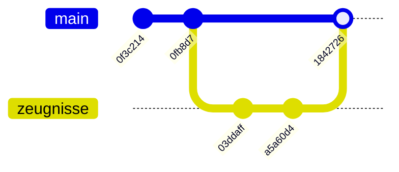
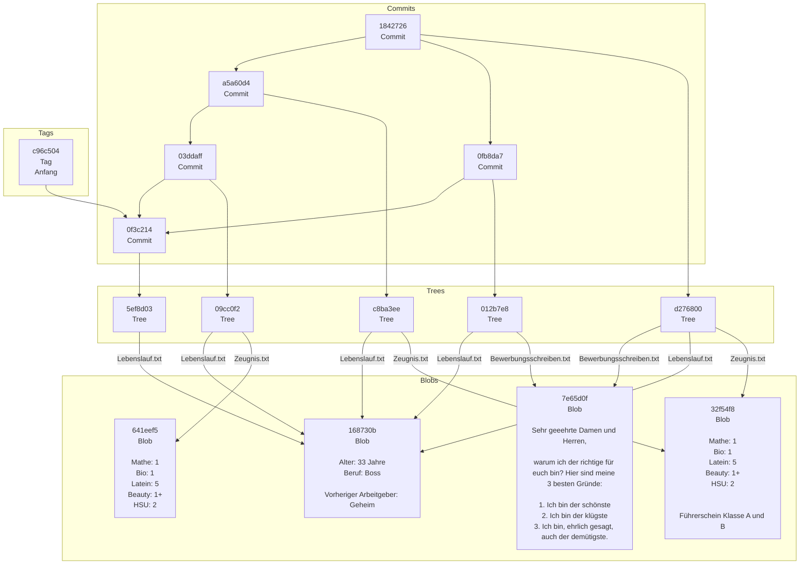

### Aufgabe: Nutzer korrekt einstellen

```commandline
git config --global user.name "Viktor Reichert"
git config --global user.email "viktor.reichert@qualidy.de"
```

### Aufgabe: Welche Vorteile?

**Kommunikation über E-Mail (Dateien als Anhänge austauschen)**:

* Eignet sich bei einfachen Projekten, bei denen nur eine Partei eine Datei manipuliert.
* Vorteil: An der Mail kann man erkennen, dass die korrekte Person mit Projektversionen vorschlägt.
* Vorteil: Automatische Notifizierung bei Projektversionen.
* Vorteil: Alle Projektversionen sind vorhanden und können wiederhergestellt werden...
* Nachteil: ...außer die Mail wird gelöscht.
* Nachteil: Gerät sehr schnell außer Kontrolle.


**Gemeinsames Laufwerk, auf das alle Projektbeteiligten Zugreifen können**

* Eignet sich bei Projekten mit großen Dateien, die nicht geändert werden, in denen eigentlich nur ein Lagerraum gebraucht wird. (z.B. 100h Videomaterial)
* Vorteil: Alle haben immer auf den aktuellen Status des Projektes Zugriff.
* Nachteil: Aber es gibt auch nur den aktuellen Status des Projektes.
* Nachteil: Alternative Projektversionen müssen erstellt werden, indem die gesamte Ordnerstruktur kopiert wird.
* Nachteil: Änderungen sind schwer bis gar nicht nachvollziehbar.
* Nachteil: Gerät nach kurzer Zeit außer Kontrolle.

**Paralleles Arbeiten an einer Datei, die in der Cloud liegt, wie mit Google Docs oder Microsoft Word**

* Eignet sich für kleine Projekte in kleinen Teams.
* Vorteil: Änderungen anderer sind sofort für alle sichtbar und editierbar.
* Nachteil: Ungestörtes Arbeiten nur mit einer eigenen Kopie der Datei möglich.


### Aufgabe: Was ist mir wichtig?
Das musst du schon selbst wissen😉


### Aufgabe: Metaphorisch gesprochen

| Metapher                  | git                  |
|---------------------------|----------------------|
| Bücherregal               | Repository           |
| Erster Tisch              | Working Tree         |
| Zweiter Tisch mit Kamera  | Index / Staging Area |
| Foto vom zweiten Tisch    | Commit               |
| Zettel auf aktuellem Foto | Branch               |

### Aufgabe: Check Please!

<details>
<summary>
🎦 Video
</summary>

</details>


Die Commitmessages sagen an, was in den jeweiligen Commits passiert.

### Aufgabe: Hilfe zur Selbsthilfe

```console
$ git help
usage: git [--version] [--help] [-C <path>] [-c <name>=<value>]
           [--exec-path[=<path>]] [--html-path] [--man-path] [--info-path]
           [-p | --paginate | -P | --no-pager] [--no-replace-objects] [--bare]
           [--git-dir=<path>] [--work-tree=<path>] [--namespace=<name>]
           <command> [<args>]
...
```

Die ersten drei Befehle rufen die Hilfe für den Befehl `init` auf.

Mit der Option -g können wir auch auf die Liste der internen Anleitungen zugreifen:

```console
$ git help -g
The common Git guides are:
   attributes          Defining attributes per path
   cli                 Git command-line interface and conventions
   core-tutorial       A Git core tutorial for developers
...
$ git help core-tutorial
```

* Die spitzen Klammern `<...>`sind Platzhalter für Inhalte, wie Branchnamen.
* Die eckigen Klammern `[..]` ist ein optionaler Parameter.
* Die eckigen Klammern mit Pipes `[..|..|..]` sind optionale Parameter, von denen nur einer gewält werden kann.
* Die runden Klammern mit Pipes `(..|..)` sind Parameter, von denen einer gewählt werden **muss**.
* Ein Befehl muss mehrfach gelistet werden, weil sich nur so in dieser Syntax alle möglichen Aufrufmöglichkeiten darstellen lassen.

### Aufgabe: cat-file

<details>
<summary>
🎦 Video
</summary>

</details>


