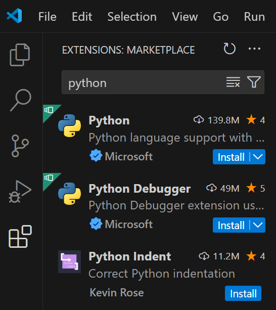

# Installation

{{ youtube_video("https://www.youtube.com/embed/chPCpYNJe_Q?si=frU_Z_VwSGnPWEPF") }}

Um mit dem Programmieren loslegen zu können müssen wir zunächst Python und eine Entwicklungsumgebung installieren:

*   :simple-python: **Python**

    ---
    
    Um Pythonprogramme schreiben und ausführen zu können benötigen Sie das Programm _Python_ auf dem Rechner.
    Dann können wir .py-Dateien schreiben und ausführen.

    Installiere Python über
    [Microsoft Store](https://apps.microsoft.com/detail/9ncvdn91xzqp?hl=de-de&gl=DE) (1)
    oder [python.org](https://www.python.org/downloads/)
    { .annotate }
    
    1. Suche nach "Store" in der Suchleiste, um den _Microsoft Store_ auf deinem Rechner zu finden. Hier kannst du nach "Python 3.12" suchen und es installieren.

*   **Entwicklungsumgebung**
 
    ---

    Um bequem Pythonprogramme zu schreiben Nutzen wir eine Entwicklungsumgebung. (1)
    { .annotate }
    
    1. Alle hier vorgeschlagenen Entwicklungsumgebungen sind gleichwertig. Wir werden hier mit Visual Studio Code arbeiten.

    === ":material-microsoft-visual-studio-code: Visual Studio Code"
        
        [Microsoft Store](https://apps.microsoft.com/detail/9ncvdn91xzqp?hl=de-de&gl=DE) (1)
        oder [code.visualstudio.com](https://code.visualstudio.com/Download)
        { .annotate }
    
        1. Suche nach "Store" in der Suchleiste, um den _Microsoft Store_ auf deinem Rechner zu finden. Hier kannst du nach "vscode" suchen und es installieren.

        Starte Visual Studio Code und installiere dann die Erweiterung "Python". (1)
        { .annotate }
    
        1. 

    === ":simple-pycharm: PyCharm Community Edition"
        
        [jetbrains.com](https://www.jetbrains.com/de-de/pycharm/download/?section=windows) (1)
        { .annotate }

        1. Nutze den unteren Link zum Download der kostenfreien Community Edition (schwarz hinterlegt). Der obere Link ist eine 30-Tage-Testversion der Professional Edition.
        

{{ task(file="tasks/erstes_programm.yaml") }}

!!! info "Strukturiert bleiben"

    Im folgenden werden Sie viele .py-Dateien erstellen. Sortieren sie diese mit Hilfe von Unterordnern, um nicht die Übersicht
    zu verlieren. So können Sie z.B. für jedes Seite hier im Browser einen eigenen Unterordner, mit dem Namen des Abschnitts.
