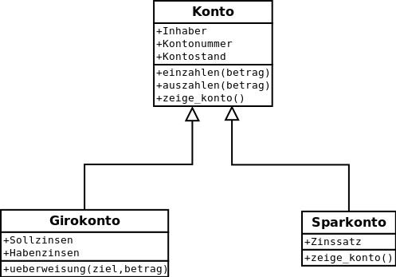

# Konstruktor und Destruktor

Es gibt zwei spezielle Methoden, die in Verbindung mit einer Klasse definiert werden:
- Die Konstruktor Methode wird verwendet, um einem Objekt zu Beginn seiner Lebensdauer Anfangswerte zuzuweisen.
- Die Destruktor-Methode wird verwendet, um Aktionen am Ende der Lebensdauer eines Objekts auszulösen, z. B. um eine geöffnete Datei zu schließen.

Der angegebene Name `__init__()` spezifiziert die Konstruktor-Methode.
Der angegebene Name `__del__()` spezifiziert die Destruktor-Methode.

Konstrukteure werden häufig verwendet. Sie ermöglichen eine gezieltere Erstellung von Objekten. Destruktoren werden weniger häufig verwendet.

Beispiel:
```python
# Create a class
class Vehicle:
    # Create a constructor method
    def __init__(self, v_t, m_s, c):
        self.speed = None
        self.vehicle_type = v_t
        self.max_speed = m_s
        self.color = c

    # Create a destructor method
    def __del__(self):
        print("Vehicle has arrived! ")
        print(f"Object {self.vehicle_type} removed!")

    # Create a class method
    def drive_off(self, speed):
        self.speed = speed
        print(f"The vehicle is driving with {self.speed} km/h")


# Create an object of this class
car = Vehicle("Porsche", 350, "Red")
# Let's drive this car
car.drive_off(10)

# Output is:
# The vehicle is driving with 10 km/h
# Vehicle has arrived! 
# Object Porsche removed!
```

Exersice:  
Write a Program to create a class by name Students, and initialize attributes like name, age, and grade while creating an object.  
Write a method to display information about this student!  
Test your class!

Solution:
```python
# Class
class Student:
    # Constructor
    def __init__(self, name, age, grade):
        self.name = name
        self.age = age
        self.grade = grade

    # Method
    def information(self):
        print(f"{self.name} is {self.age} years old and the grade is {self.grade}")

    # This method checks if the student can drink and buy alcohol
    def alcohol_allowed(self):
        if self.age > 18:
            print(f"{self.name} can drink!")
            return True
        else:
            print(f"{self.name} can not drink!")
            return False


# Create some students
student_1 = Student("Alex", 17, 3)
student_2 = Student("Müller", 24, 6)
# Display information
student_1.information()
# Check if students can drink alcohol
student_1.alcohol_allowed()
student_2.alcohol_allowed()

# Output is:
# Alex is 17 years old and the grade is 3
# Alex can not drink!
# Müller can drink!
```

# Andere spezielle Methoden

Wie die Methoden `__init()__` und `__del()__` gibt es weitere wichtige Methoden im Zusammenhang mit Klassen:
-   `__str()__`
-   `__repr()__`


Wenn ein Objekt mit der Funktion `print()` ausgegeben wird, wird die spezielle Methode `__str()__` aufgerufen, sofern sie definiert ist. Standardmäßig wird dabei eine Zeichenkette für die Ausgabe der Eigenschaften zurückgegeben.

Beispiel:
```python
class Person:
    # Constructor
    def __init__(self, first_name, last_name, age):
        self.first_name = first_name
        self.last_name = last_name
        self.age = age

    # Special method which will be called if using print() or str() function to an object
    # This method must return a string value!
    # The output of the method" __str__()" is only used to display the output to the user.
    def __str__(self):
        return f'First name: {self.first_name}, Last name: {self.last_name}, Age: {self.age}'


# Create an object
teacher = Person("Max", "Musterman", 20)
# print this object
print(teacher)
```

Man kann Informationen über ein Objekt mit der eingebauten Funktion `__repr()__` erhalten. Man kann das Layout dieser Informationen selbst bestimmen, wenn man die spezielle Methode `__repr()__` innerhalb der Klassendefinition definiert. Diese Methode wird jedoch in der Praxis nur selten verwendet und soll daher hier nicht weiter behandelt werden. Sie funktioniert genau wie die Methode `__strt()__`! Sowohl die str- als auch die repr-Funktionen geben eine String-Repräsentation des Objekts zurück. Die str-String-Repräsentation soll menschenfreundlich sein und hauptsächlich für Protokollierungszwecke verwendet werden, während die repr-Repräsentation Informationen über das Objekt enthalten soll, damit es wieder konstruiert werden kann.

# Getter und Setter

Im Vergleich zu anderen Sprachen verwendet Python die Getter- und Setter-Methode, um Logik zum Abrufen und Setzen eines Wertes hinzuzufügen. Um die Getter- und Setter-Eigenschaft zu erreichen, wird bei der Definition der normalen get()- und set()-Methoden keine spezielle Implementierung berücksichtigt.

Beispiel:
```python
# Python program showing a use
# of get() and set() method
class Geek:
    def __init__(self, age=0):
        self.age = age

    # getter method
    def get_age(self):
        return self.age

    # setter method
    def set_age(self, x):
        self.age = x

# Create an object
raj = Geek()
# Use setter method
raj.set_age(25)
# Use getter method
raj_age = raj.get_age()
print(raj_age)

# Output is:
# 25
```

Grundsätzlich besteht der Hauptzweck der Verwendung von Gettern und Settern in objektorientierten Programmen darin, die Datenkapselung zu gewährleisten (Verbergen von Daten oder Informationen vor dem Zugriff von außen). Im obigen Code fungieren `get_age()` und `set_age()` als normale Funktionen und spielen nicht die Rolle von Gettern und Settern.

# Vererbung

Eine Klasse kann ihre Attribute und Methoden an eine andere Klasse vererben. Dieser Mechanismus wird häufig genutzt. Durch die Vererbung entsteht eine Hierarchie von Klassen, die die Darstellung von Objekten mit teilweise übereinstimmenden Merkmalen ermöglicht.

Beispiel dieser Hierarchie:



Wir implementieren das obige Beispiel als Code:
```python
# Create the class "Konto" (Superclass)
class Account:

    # Constructor
    def __init__(self, owner, account_number, account_balance):
        # Attributes
        self.owner = owner
        self.account_number = account_number
        self.account_balance = account_balance

    # Methods
    def do_deposit(self, amount):
        print(f"You deposit {amount} EUR!")
        self.account_balance += amount

    def do_payout(self, amount):
        print(f"You payout {amount} EUR!")
        self.account_balance -= amount

    def show_information(self):
        print(f"Owner: {self.owner}"
              f"Account number: {self.account_number}"
              f"Account balance: {self.account_balance}")


# Child class
class Checking_account(Account):
    def __init__(self, interest, owner, account_number, account_balance):
        # The super() function is used in the child class with
        # multiple inheritance to access the function of the next parent class or superclass.
        super().__init__(owner, account_number, account_balance)
        self.interest = interest

    def bank_transfer(self, amount):
        self.account_balance -= amount


# Child class
class Savings_account(Account):
    def __init__(self, interest_rate, owner, account_number, account_balance):
        # The super() function is used in the child class with
        # multiple inheritance to access the function of the next parent class or superclass.
        super().__init__(owner, account_number, account_balance)
        self.interest_rate = interest_rate


# ---------------------------------------------------------------------------------------- #
# Main program
# Create object
my_account = Account("Alex", 42, 25000)
# Show my balance
print(my_account.account_balance)
# Lets do a deposit
my_account.do_deposit(5000)
# Show my balance
print(my_account.account_balance)
# Lets do a payout
my_account.do_payout(10000)
# Show my balance
print(my_account.account_balance)
# Create a checking account
my_checking_account = Checking_account(2, "Alex", 42, 25000)
# Show balance of my checking account
print(my_checking_account.account_balance)
# Let's do a deposit to my checking account
my_checking_account.do_deposit(5000)
# Show balance of my checking account
print(my_checking_account.account_balance)
# Show balance of my account
print(my_account.account_balance)
```