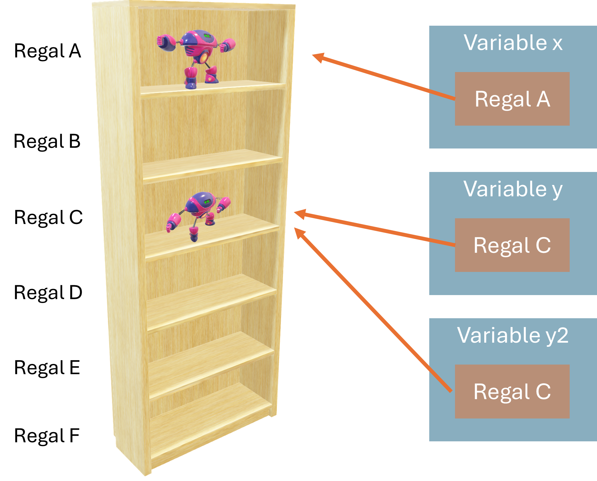

# Klassen definieren und instanziieren

{{ youtube_video("https://www.youtube.com/embed/_Kzt2M7Osfs?si=_VqBodiJVy8snbGL") }}

Die **objektorientierte Programmierung (OOP)** ist ein mächtiges Programmierparadigma, 
das auf dem Konzept von "Objekten" basiert. Im Gegensatz zu prozeduralen Programmieransätzen,
bei denen der Code als eine Abfolge von Aufgaben organisiert ist, 
legt die OOP den Fokus auf die Modellierung von reellen Entitäten und ihren Interaktionen.

## Minimalbeispiel:

Im Folgenden werden wir eine neue Klasse mit dem Schlüsselwort `class` erstellen:

```python
class Roboter:
    pass
```

Diese Klasse ist im Moment denkbar langweilig. Das `pass` sagt,
dass in diesem Block nichts passiert. Unsere Roboter haben also noch keine Eigenschaften
(das kommt noch im nächsten Kapitel)

Sie ist die Blaupause, mit der wir Instanzen der Klasse
erstellen können. Das sieht dann so aus:

```python
class Roboter:
    pass


x = Roboter()
y = Roboter()
y2 = y

print(f'id von x: {id(x)}')
print(f'id von y: {id(y)}')
print(f'id von y: {id(y2)}')
```


Wir haben hier insgesamt **drei** Objekte angelegt:

* Die Klasse `Roboter` selbst, wurde als ein Objekt bespeichert.
* Wir haben eine Instanz der Klasse Roboter mit dem Aufruf `Roboter()` erzeugt in der Variablen `x` eine Referenz zu diesem Objekt bespeichert.
* Wir haben dann eine **weitere** Instanz der Klasse Roboter erzeugt und eine Referenz zu dieser in `y` gespeichert.
* Wir haben danach eine neue Variable `y2` angelegt und in dieser die Referenz bespeichert, die auch in `y` gespeichert. ist

Bitte achte hier genau auf die Wortwahl! Ich schreibe **nicht** "In der Variablen `y` ist die Instanz gespeichert",
sondern "In der Variablen `y` ist eine **Referenz** zur Instanz gespeichert." Eine Referenz kannst du dir so vorstellen,
wie eine Anschrift, die dir Verrätt, wo du die Instanz im Speicher findest. Dieses Konzept kennen wir bereits von
zusammengesetzten Datentypen wie Listen.



🔅Merke dir: Die Klasse ist die Vorlage, mit der Instanzen gebaut werden.

🔅Vokabel: Eine neue Instanz zu erzeugen wird auch Instanziieren genannt.

🔅Merke dir: Variablen speichern eine Referenz zu Instanzen, nicht die Instanz selbst.


{{ task(file='tasks/oop_einführung_1.yaml') }}

{{ task(file='tasks/oop_einführung_2.yaml') }}


{{ task(file='tasks/oop_einführung_3.yaml') }}
