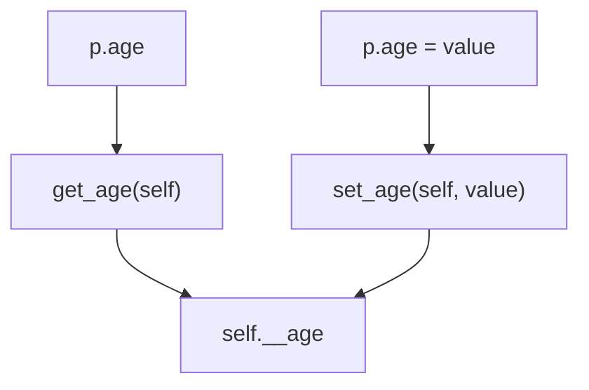

# Getter & Setter

{{ youtube_video("https://www.youtube.com/embed/lxU-wYrbb7w?si=vT4oOi07SOlCGGtD")}}

Wir können bisher auf alle Attribute unserer Klassen zugreifen.
Dies ist einfach, bietet aber auch wenig Schutz vor Quatschdaten.

Z.B. ist es im folgenden Beispiel möglich ein negatives Alter bei
einer Person zu setzen:

[Link zum Onlinecompiler💻](https://pythontutor.com/render.html#code=class%20Person%3A%0A%20%20%20%20def%20__init__%28self,%20age%29%3A%0A%20%20%20%20%20%20%20%20self.age%20%3D%20age%0A%0Ap%20%3D%20Person%28-1%29%0Aprint%28f%22Die%20Person%20ist%20%7Bp.age%7D%20Jahre%20alt.%22%29&cumulative=false&curInstr=0&heapPrimitives=nevernest&mode=display&origin=opt-frontend.js&py=3&rawInputLstJSON=%5B%5D&textReferences=false)


```python
class Person:
    def __init__(self, age):
        self.age = age

p = Person(-1)
print(f"Die Person ist {p.age} Jahre alt.")
```


Wie können wir verhindern, dass solche Eingaben möglich sind?

In anderen Programmiersprachen ist es Konvention sog. Getter- und
Setter Methoden zu definieren. Das könnte dann z.B. so aussehen:

[Link zum Onlinecompiler💻](https://pythontutor.com/render.html#code=class%20Person%3A%0A%20%20%20%20def%20__init__%28self,%20age%29%3A%0A%20%20%20%20%20%20%20%20self.set_age%28age%29%0A%0A%20%20%20%20def%20get_age%28self%29%3A%0A%20%20%20%20%20%20%20%20return%20self.age%0A%20%20%20%20%20%20%20%20%0A%20%20%20%20def%20set_age%28self,%20age%29%3A%0A%20%20%20%20%20%20%20%20self.age%20%3D%20max%280,%20age%29%0A%0A%0Ap%20%3D%20Person%28-1%29%0Aprint%28f%22Die%20Person%20ist%20%7Bp.get_age%28%29%7D%20Jahre%20alt.%22%29&cumulative=false&curInstr=0&heapPrimitives=nevernest&mode=display&origin=opt-frontend.js&py=3&rawInputLstJSON=%5B%5D&textReferences=false)


```python
class Person:
    def __init__(self, age):
        self.set_age(age)

    def get_age(self):
        return self.age
        
    def set_age(self, age):
        self.age = max(0, age)


p = Person(-1)
print(f"Die Person ist {p.get_age()} Jahre alt.")
```


Nun können wir mithilfe vom Setter `set_age` sicherstellen,
dass das Attribut `age` stets einen sinnvollen Wert hat.

Doch um ehrlich zu sein, sieht das nicht wirklich nach Pythoncode
aus. Es ist einerseits umständlich, dass wir das Attribut über
solche Getter und Setter erfragen sollen und andererseits, ist
es uns immer noch möglich das Attribut direkt zu manipulieren!

[Link zum Onlinecompiler💻](https://pythontutor.com/render.html#code=class%20Person%3A%0A%20%20%20%20def%20__init__%28self,%20age%29%3A%0A%20%20%20%20%20%20%20%20self.set_age%28age%29%0A%20%20%20%20%20%20%20%20%0A%20%20%20%20def%20get_age%28self%29%3A%0A%20%20%20%20%20%20%20%20return%20self.age%0A%20%20%20%20%0A%20%20%20%20def%20set_age%28self,%20age%29%3A%0A%20%20%20%20%20%20%20%20self.age%20%3D%20max%280,%20age%29%0A%0A%0Ap%20%3D%20Person%2830%29%0Ap.age%20%3D%20-20%0Aprint%28f%22Die%20Person%20ist%20%7Bp.get_age%28%29%7D%20Jahre%20alt.%22%29&cumulative=false&curInstr=0&heapPrimitives=nevernest&mode=display&origin=opt-frontend.js&py=3&rawInputLstJSON=%5B%5D&textReferences=false)


```python
class Person:
    def __init__(self, age):
        self.set_age(age)
        
    def get_age(self):
        return self.age
    
    def set_age(self, age):
        self.age = max(0, age)


p = Person(30)
p.age = -20
print(f"Die Person ist {p.get_age()} Jahre alt.")
```


Die Antwort: **Property**

Wir definieren ein Attribut `_age`, dass das Alter tatsächlich speichert.

Es gibt eine vorimplementierte Klasse `property`, mit der wir die Methoden
`get_age` und `set_age` nach außen als ein Attribut zur Verfügung stellen,
aber die Änderungen an `age` in Wirklichkeit an `_age` weitergeleitet werden.

[Link zum Onlinecompiler💻](https://pythontutor.com/render.html#code=class%20Person%3A%0A%20%20%20%20def%20__init__%28self,%20age%29%3A%0A%20%20%20%20%20%20%20%20self.age%20%3D%20age%0A%0A%20%20%20%20def%20get_age%28self%29%3A%0A%20%20%20%20%20%20%20%20return%20self.__age%0A%0A%20%20%20%20def%20set_age%28self,%20age%29%3A%0A%20%20%20%20%20%20%20%20self.__age%20%3D%20max%28age,%200%29%0A%0A%20%20%20%20age%20%3D%20property%28get_age,%20set_age%29%0A%0A%0Ap%20%3D%20Person%28-30%29%0Aprint%28f%22Die%20Person%20ist%20%7Bp.age%7D%20Jahre%20alt.%22%29&cumulative=false&curInstr=0&heapPrimitives=nevernest&mode=display&origin=opt-frontend.js&py=3&rawInputLstJSON=%5B%5D&textReferences=false)


```python
class Person:
    def __init__(self, age):
        self.age = age

    def get_age(self):
        return self.__age

    def set_age(self, age):
        self.__age = max(age, 0)

    age = property(get_age, set_age)


p = Person(-30)
print(f"Die Person ist {p.age} Jahre alt.")
```




{{ task(file="tasks/oop_getter_setter_1.yaml") }}

{{ task(file="tasks/oop_getter_setter_2.yaml") }}

## Schönheit mit Dekoratoren

{{ youtube_video("https://www.youtube.com/embed/DX2cTLtPw60?si=o2DDk_i2fKIg35X5")}}

In Python, ist es möglich über Funktionen **Dekoratoren** zu setzen.
Diese können das Verhalten von Funktionen auf vielfältige Art und Weise
manipulieren. Zur Definition von Properties, wird oft der `@property`
Dekorator verwendet. Das kann dann so aussehen:

[Link zum Onlinecompiler💻](https://pythontutor.com/render.html#code=class%20Person%3A%0A%20%20%20%20def%20__init__%28self,%20age%29%3A%0A%20%20%20%20%20%20%20%20self.age%20%3D%20age%0A%0A%20%20%20%20%40property%0A%20%20%20%20def%20age%28self%29%3A%0A%20%20%20%20%20%20%20%20return%20self.__age%0A%0A%20%20%20%20%40age.setter%0A%20%20%20%20def%20age%28self,%20age%29%3A%0A%20%20%20%20%20%20%20%20self.__age%20%3D%20max%28age,%200%29%0A%0A%0Ap%20%3D%20Person%28-30%29%0Aprint%28f%22Die%20Person%20ist%20%7Bp.age%7D%20Jahre%20alt.%22%29&cumulative=false&curInstr=0&heapPrimitives=nevernest&mode=display&origin=opt-frontend.js&py=3&rawInputLstJSON=%5B%5D&textReferences=false)


```python
class Person:
    def __init__(self, age):
        self.age = age

    @property
    def age(self):
        return self.__age

    @age.setter
    def age(self, age):
        self.__age = max(age, 0)


p = Person(-30)
print(f"Die Person ist {p.age} Jahre alt.")
```


Wir stellen fest:

* Getter und Setter werden direkt wie das Property benannt, `get_` bzw. `set_` als Präfix ist also nicht mehr nötig.
* An den Getter schreiben wir `@property`.
* An den Setter schreiben wir `@x.setter`, wobei `x` der Name der Funktion ist, bei der wir `@property` gesetzt haben.

{{ task(file="tasks/oop_getter_setter_3.yaml") }}