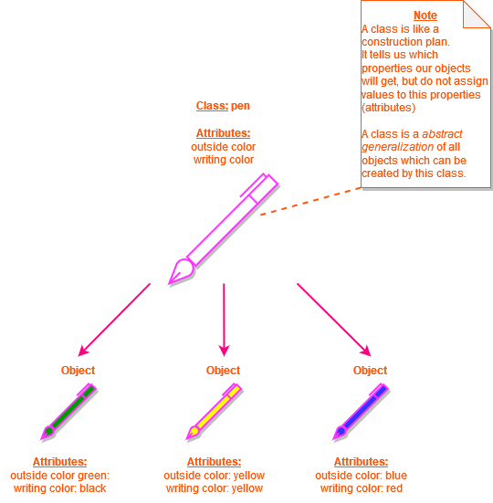

In der Softwareentwicklung ist die Objektorientierung (kurz: OO) eine Sichtweise komplexer Systeme, bei der ein System durch die Interaktion kooperierender Objekte beschrieben wird. Der Begriff Objekt ist nicht sehr eindeutig, wichtig an einem Objekt ist nur, dass es bestimmte Attribute (Eigenschaften) und Methoden hat, die ihm zugeordnet sind, und dass es in der Lage ist, Nachrichten von anderen Objekten zu empfangen oder an sie zu senden. Die Objektorientierung wird meist im Rahmen der objektorientierten Programmierung eingesetzt, um die Komplexität der entstehenden Programme zu reduzieren.

Die objektorientierte Programmierung (OOP) ist ein gängiges Paradigma, das heute in fast allen Sprachen zur Programmierung verwendet wird. Und es ist dasjenige, auf dem heutzutage fast jedes größere Softwareprojekt basiert; mal mehr, mal weniger. Bei der objektorientierten Programmierung wird der Code in "Objekte" aufgeteilt. Das Gegenteil ist die prozedurale Programmierung, bei der eine Sequenz von Code Stück für Stück abgearbeitet wird.

Da die Objektorientierung dem menschlichen Denken sehr ähnlich ist, kann dieser Programmierstil auch von einem menschlichen Programmierer sehr intuitiv verwendet werden. Es ist also ein Konzept, das für Menschen leicht zu verstehen und anzuwenden ist, da es auf unserem natürlichen menschlichen Denken basiert.

Ein Objekt ist eine genaue Beschreibung z.B. eines Stiftes. Die Attribute (Eigenschaften) haben einen Wert oder einen festen Zustand. Zum Beispiel hat unser Stift die Außenfarbe weiß und die Schreibfarbe schwarz. Die Klasse hingegen ist eine Verallgemeinerung aller Stiftobjekte. Sie beschreibt, welche Eigenschaften ein Stift haben kann, ohne ihnen einen Wert zuzuweisen. Nur das Objekt repräsentiert das Ding Stift, das wir mit all seinen Eigenschaften vor uns haben.

Ein weiteres Beispiel ist die Klasse "Mensch". Schon vor der Geburt wissen wir, welche Eigenschaften (z.B. Augenfarbe, Größe, Geschlecht) und Funktionen (z.B. Sprechen) ein Mensch später haben wird, aber wir wissen nicht, welchen Wert sie haben. Eine einzelne Person entspricht dann einem Objekt der Klasse "Mensch" (auch wenn der Begriff Objekt in diesem Zusammenhang vielleicht etwas unpassend ist), dessen Eigenschaften bei der Erstellung festgelegt werden (z.B. Augenfarbe=braun).

In der objektorientierten Programmierung gehört jedes Objekt zu einer Klasse. Diese hat die Attribute (Eigenschaften) und die Methoden (Interaktionen) dieser Klasse. In unserer Klasse "Stift" könnte eine Methode "schreiben" heißen. Methoden sind nichts anderes als Funktionen, die nur von einem bestimmten Objekt ausgeführt werden können. Ein Objekt ist also nur eine Möglichkeit, einige Variablen und Funktionen in einem "Ding" zu kombinieren.