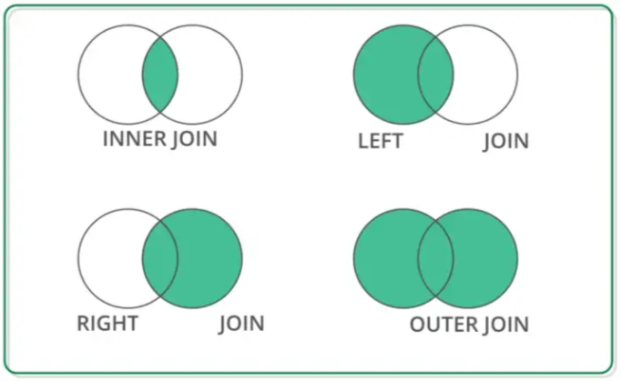
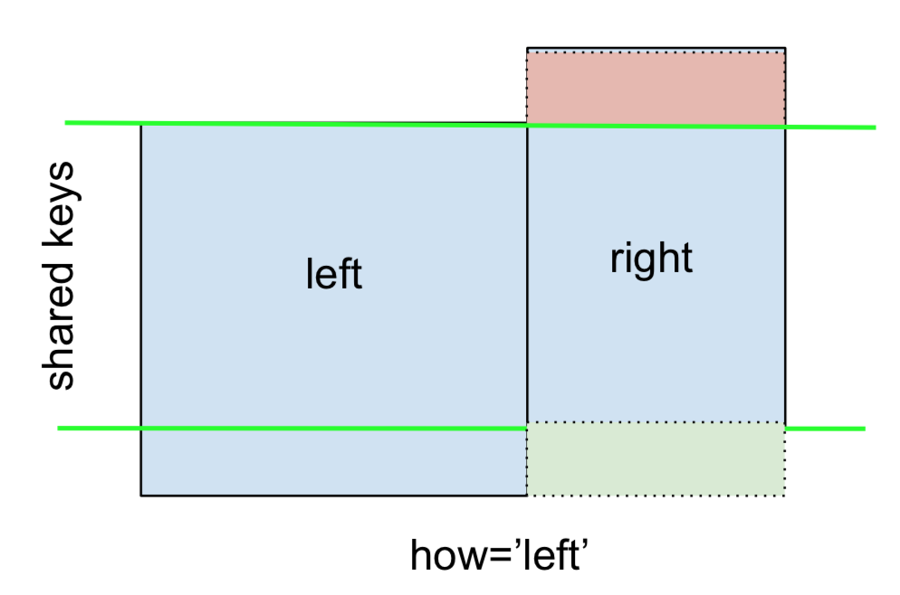
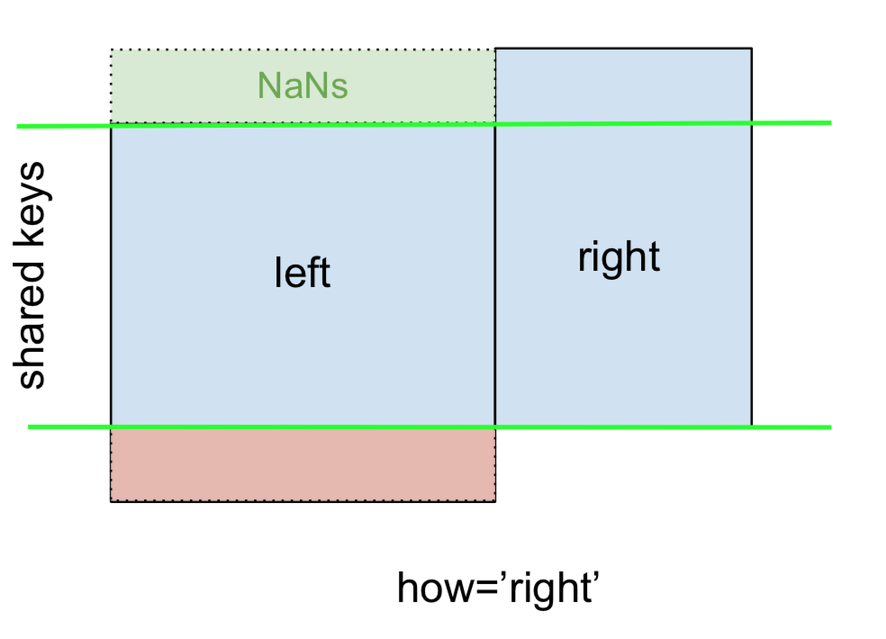
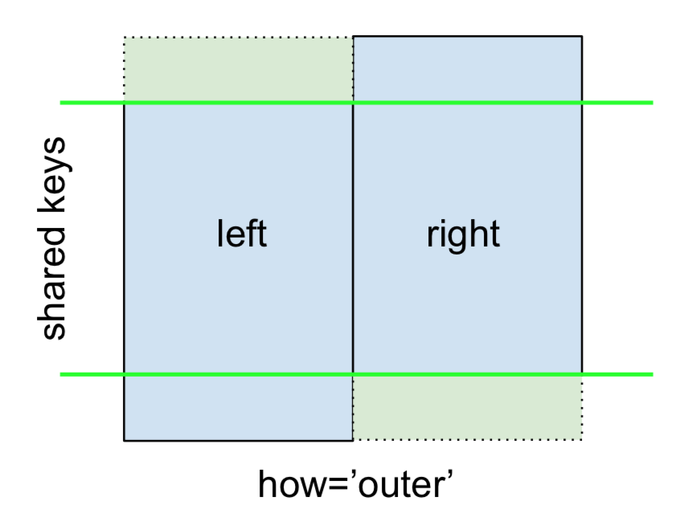

In der Praxis kann es schnell passieren dass die Daten über mehrere `DataFrames` verteilt sind weil sich z.B. die Daten in unterschiedlichen CSV-Dateien befinden. Dann hat man häufig die Aufgabe die `DataFrames` zusammen zu fügen.

## Zusammenfügen mit merge()

Mit der Methode `merge()` lassen sich zwei DataFrames vereinigen zu einem neuen DataFrame.

Dazu müssen folgende Parameter beachtet werden:

- `left`: Hier wird das DataFrame angegeben,  welches als Ausgangspunkt dient für eine Vereinigung
- `right`: Hier wird das DataFrame angegeben, welches mit dem anderen DataFrame zu vereinigen ist
- `on`: Anhand welcher Spalte soll die Verschmelzung durchgeführt werden

	Beispiel:
```python
import pandas as pd
pd.set_option("display.max_rows", None)
pd.set_option("display.max_columns", None)

student_df = pd.DataFrame({  
    "Roll No": [500, 501, 503, 504, 505, 506],  
    'Name': ["Jennifer", "Travis", "Bob", "Emma", "Luna", "Anish"],  
    'Gender':  ["Female", "Male", "Male", "Female", "Female", "Male"],  
    'Age': [17, 18, 17, 16, 18, 16]  
})  
  
grades_df = pd.DataFrame({  
    "Roll No": [501, 502, 503, 504, 505, 506],  
    'Name': ["Jennifer", "Travis", "Bob", "Emma", "Luna", "Anish"],  
    "Grades": ["A", "B+", "A-", "A", "B", "A+"]  
})  
  
print(student_df)  
print(grades_df)  
  
df_merged = pd.merge(left=student_df, right=grades_df, on="Name")  
print(df_merged)
```

Im obigen Beispiel wird das "linke" `DataFrame` herangenommen und die Spalte "Roll No" wird in "Roll No_x" unbenannt weil sie in beiden DataFrames vorkommt. 
Es soll ja über die Spalte Name zusammengefügt werden, deswegen wird von beiden DataFrames die Spalte "Name" verglichen und falls die Werte in beiden Spalten vorhanden sind werden sie übernommen.
Die Spalte "Gender" und "Age" wird einfach übernommen weil sie nicht im rechten DataFrame vorkommt.
Im rechten DataFrame wird die Spalte "Roll No" mit dem Suffix "y" versehen weil sie in beiden `DataFrames` vorkommt und bekommt die neue Bezeichnung "Roll No_y". Anschließend wird sie in das neue DataFrame übernommen.
Ebenfalls wird die Spalte "Grades" einfach übernommen weil sie nicht im linken DataFrame vorkommt.

Es ist auch möglich den Parameter `on` nicht zu definieren, also `on=None` zu setzen. Wenn dass der Fall ist wird die Schnittmenge jeder Spalte gebildet.
Dies geschieht folgendermaßen:
Die Zeilen 1 bis 5 kommen sowohl im linken als auch rechten DataFrame vor, dabei Stimmen die Werte aus den Spalten "Roll No", "Name" und "Gender" überein. Die nicht vorhandenen Spalten "Age" und "Grades" werden übernommen.

Beispiel:
```python
import pandas as pd  
  
student_df = pd.DataFrame({  
    "Roll No": [500, 501, 503, 504, 505, 506, 507],  
    'Name': ["Jennifer", "Travis", "Bob", "Emma", "Luna", "Anish", "Paul"],  
    'Gender':  ["Female", "Male", "Male", "Female", "Female", "Male", "Male"],  
    'Age': [17, 18, 17, 16, 18, 16, 15]  
})  
  
grades_df = pd.DataFrame({  
    "Roll No": [501, 502, 503, 504, 505, 506],  
    'Name': ["Jennifer", "Travis", "Bob", "Emma", "Luna", "Anish"],  
    "Grades": ["A", "B+", "A-", "A", "B", "A+"]  
})  
  
print(student_df)  
print(grades_df)  
  
df_merged = pd.merge(left=student_df, right=grades_df, on=None)  
print(df_merged)
```

- `how`: Hier wird die Art der Vereinigung angegeben (Angabe nicht notwendig). Man unterscheidet zwischen:
	- left
	- right
	- inner
	- outer

Die folgende Grafik erklärt die unterschiedlichen Vereinigungen. Dabei sind mit grüner Farbe die Werte der einzelnen Spalten gemeint:


Folgende Grafiken können zum Verständnis beitragen:





Beispiel:
```python
import pandas as pd  
  
student_df = pd.DataFrame({  
    "Roll No": [500, 501, 503, 504, 505, 506, 507],  
    'Name': ["Jennifer", "Travis", "Bob", "Emma", "Luna", "Anish", "Paul"],  
    'Gender':  ["Female", "Male", "Male", "Female", "Female", "Male", "Male"],  
    'Age': [17, 18, 17, 16, 18, 16, 15]  
})  
  
grades_df = pd.DataFrame({  
    "Roll No": [501, 502, 503, 504, 505, 506],  
    'Name': ["Jennifer", "Travis", "Bob", "Emma", "Luna", "Anish"],  
    "Grades": ["A", "B+", "A-", "A", "B", "A+"]  
})  
  
print(student_df)  
print(grades_df)  
  
df_merged = pd.merge(left=student_df, right=grades_df, on=None, how="outer")  
print(df_merged)
```

Hier wurde `on="outer"` verwendet, wie man in der Grafik sieht wird die Vereinigungsmenge der beiden DataFrames gebildet. In dem neuen DataFrame kommen also alle Werte vom linken und rechten DataFrame vor.

- `suffixes`: Wir hatten bereits gesehen wie ein Suffix zu Spaltennamen hinzugefügt wird ("Roll No_x" und "Roll No_y"). Mit diesem Parameter können wir einen individuellen Suffix erstellen.

Beispiel:
```python
import pandas as pd  
  
pd.set_option("display.max_rows", None)  
pd.set_option("display.max_columns", None)  
  
student_df = pd.DataFrame({  
    "Roll No": [500, 501, 503, 504, 505, 506],  
    'Name': ["Jennifer", "Travis", "Bob", "Emma", "Luna", "Anish"],  
    'Gender': ["Female", "Male", "Male", "Female", "Female", "Male"],  
    'Age': [17, 18, 17, 16, 18, 16]  
})  
  
grades_df = pd.DataFrame({  
    "Roll No": [501, 502, 503, 504, 505, 506],  
    'Name': ["Jennifer", "Travis", "Bob", "Emma", "Luna", "Anish"],  
    "Grades": ["A", "B+", "A-", "A", "B", "A+"]  
})  
  
print(student_df)  
print(grades_df)  
  
df_merged = pd.merge(left=student_df, right=grades_df, on="Name", suffixes=(" left_table", " right_table"))  
print(df_merged)
```

## Zusammenfügen mit join()

`join()` verknüpft Daten nicht aufgrund von Spalten, sondern ausschließlich am Index.

Beispiel:
```python
import pandas as pd  
df = pd.DataFrame({'Name' : ["Peter", "Karla", "Anne", "Nino", "Andrzej"],  
                   'Geschlecht': ['M','W','W','M','M'],  
                   'Alter': [34, 53, 16, 22, 61],  
                   'Nationalität': ["deutsch", "schweizerisch", "deutsch", "italienisch", "polnisch"],  
                   'Gehalt': [3400, 4000, 0, 3000, 2300]},  
                  index = ['ID-123', 'ID-462', 'ID-111', 'ID-997', 'ID-707'])  
  
  
wohnort = pd.DataFrame({'Wohnort': ['Paderborn', 'Kassel', 'Berlin', 'Aachen', 'Bremen'],  
                           'ID': ['ID-462', 'ID-111', 'ID-123', 'ID-997', 'ID-707']})  
  
print(df)  
print()  
print(wohnort)  
  
wohnort_with_id_as_index = wohnort.set_index('ID')  
df_joinded = df.join(wohnort_with_id_as_index)  
print()  
print(df_joinded)
```

## Zusammenfügen mit concat()

Mit `concat()` hat man die Möglichkeit mehr als drei DataFrame mit einander zu vereinigen.

Beispiel:
```python
import pandas as pd  
df = pd.DataFrame({'Name' : ["Peter", "Karla", "Anne", "Nino", "Andrzej"],  
                   'Geschlecht': ['M','W','W','M','M'],  
                   'Alter': [34, 53, 16, 22, 61],  
                   'Nationalität': ["deutsch", "schweizerisch", "deutsch", "italienisch", "polnisch"],  
                   'Gehalt': [3400, 4000, 0, 3000, 2300]},  
                  index = ['ID-123', 'ID-462', 'ID-111', 'ID-997', 'ID-707'])  
  
  
wohnort = pd.DataFrame({'Wohnort': ['Paderborn', 'Kassel', 'Berlin', 'Aachen', 'Bremen'],  
                           'ID': ['ID-462', 'ID-111', 'ID-123', 'ID-997', 'ID-707']})  
  
beruf = pd.DataFrame({'Beruf': ['Schreiner','Maler','DataScientist','Makler','Banker']},  
                     index = ['ID-123', 'ID-462', 'ID-111', 'ID-997', 'ID-707'])  
  
wohnort_with_id_as_index = wohnort.set_index('ID')  
  
concated_df = pd.concat([df, wohnort_with_id_as_index, beruf], axis=1, sort=False)  
  
print(concated_df)
```