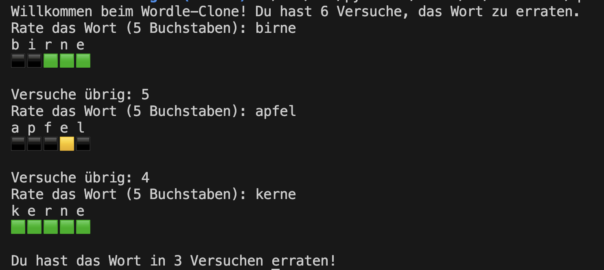

# Wordle

Ziel des Tages ist es, einen Klon von Wordle zu implementieren. Hierbei sollen pro Projektschritt folgende Schritte durchgeführt werden:

## Tagesprojekt - Viraler Wordle Klon
[Wordle Spiel](https://www.nytimes.com/games/wordle/index.html)

### Benötigte Konzepte
- [Input und Output](../variables/nutzereingaben.md)
- [Verzweigungen](../bedingter_code/bedingter_code.md)
- [Schleifen](../loops/loops.md)
- [Funktionen](../functions/functions.md)

## Palindrome prüfen mit Indices
Schreibe ein Python-Programm, das überprüft, ob ein gegebenes Wort ein Palindrom ist oder nicht.

Ein Palindrom ist ein Wort, 
das rückwärts gelesen genauso wie vorwärts gelesen wird 
(z.B. "anna", "otto", "madam"). 

### Anforderung
- Nutze for-Loops und Indizes
- Verwende dabei keine vorgefertigten Funktionen wie reversed() oder Slicing (`[::-1]`)

<!-- [Lösungen](solution_wordle.md) -->

## Password Checker 
Entwickle eine Funktion zur Überprüfung der Stärke eines Passworts. Nutze dabei  `.isalpha()`, `.isdigit()`, und die Überprüfung auf Sonderzeichen.

### Anforderungen
- mindestens 8 Zeichen lang
- mindestens einen Buchstaben
- mindestens eine Zahl
- mindestens ein Sonderzeichen aus einer vordefinierten Liste von Sonderzeichen (!@#$%^&*()-_=+[]{};:'",.<>/?\|)

<!-- [Lösungen](solution_wordle.md) -->

## Password Generator 
Entwickle ein Python-Programm, das zufällige Passwörter einer gegebenen Länge generiert. 

Das Passwort soll eine Kombination aus Großbuchstaben, Kleinbuchstaben, Zahlen und Sonderzeichen sein. 

### Anforderungen
- Länge des Passworts muss eine positive ganze Zahl sein
- Generiere ein zufälliges Passwort, das Großbuchstaben, Kleinbuchstaben, Zahlen und Sonderzeichen enthält

<!-- [Lösungen](solution_wordle.md) -->

## Viraler Wordle Klon 

Entwickle ein Konsolenbasiertes Spiel das dem populären Spiel Wordle nachempfunden ist. Bei diesem Spiel soll der Spieler ein geheimes fünfbuchstabiges Wort erraten, indem er wiederholt Wörter derselben Länge rät. Nach jedem Rateversuch erhält der Spieler Feedback in Form von farbigen Hinweisen, die anzeigen, welche Buchstaben korrekt sind und ob sie sich an der richtigen Position befinden.

### Anforderungen
- Das Spiel wählt zufällig ein Wort aus einer Liste gültiger fünfbuchstabiger Wörter.
- Der Spieler darf bis zu sechs Mal raten. Jeder Rateversuch muss ein gültiges fünfbuchstabiges Wort sein.
- Nach jedem Rateversuch gibt das Spiel Feedback für jeden Buchstaben des geratenen Wortes:
    - Ein grüner Hinweis (🟩) bedeutet, dass der Buchstabe im geheimen Wort enthalten ist und an der richtigen Stelle steht.
    - Ein gelber Hinweis (🟨) zeigt an, dass der Buchstabe im geheimen Wort enthalten ist, aber an einer anderen Stelle steht.
    - Ein grauer Hinweis (⬛) bedeutet, dass der Buchstabe nicht im geheimen Wort vorkommt.

### Erweiterungen
- Pon de Replay, ermögliche dem Spieler ein neues Wort zu ziehen, ohne das Programm neu starten zu müsssen. Speichere die bereits gespielten Wörter in einer der uns bekannten Datenstrukturen (Liste, Dict, etc.) und zeige sie nach beenden einer Runde an.
- Füge ein Hinweis-system hinzu, mit dem z.B. ein einzelner Buchstabe oder die Anzahl der Vokale im Wort gezeigt wird.
- Erlaube den Spielern, die Länge des zu erratenden Wortes vor Spielbeginn zu wählen (leicht - 5, mittel - 6, schwer - 7).

<!-- [Lösungen](solution_wordle.md) -->