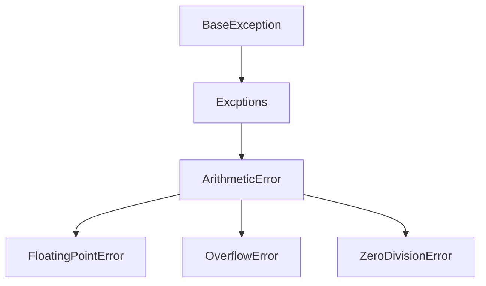

# Exception Handling in Python

Beim Programmieren in Python ist es wichtig, Ausnahmen ordnungsgemäß zu behandeln, 
um robusten und fehlerresistenten Code zu schreiben. Ausnahmen sind Ereignisse, 
die während der Ausführung eines Programms auftreten und den normalen Ablauf unterbrechen. 

Du kannst durch korrektes Handling von Ausnahmen Fehler auf elegante Weise bewältigen
und so die Gesamtzuverlässigkeit deines Codes verbessern.

## Grundlagen des Exception Handlings

### Try-Except-Block

Die Blöcke `try` und `except` werden verwendet, um Ausnahmen in Python zu behandeln. 
Der `try`-Block enthält den Code, der eine Ausnahme auslösen könnte, 
und der `except`-Block gibt an, wie die Ausnahme behandelt werden soll.

```python
try:
    # Code, der eine Ausnahme auslösen könnte
    ergebnis = 10 / 0
except ZeroDivisionError as e:
    # Behandlung der spezifischen Ausnahme
    print(f"Fehler: {e}")

print("Ich lebe noch und kann weiter machen")
```

Der gleiche Code ohne Exceptionhandling bricht die Durchführung
des Programms ab:

```python
ergebnis = 10 / 0

print("Das wirst du niemals sehen")
```


### Mehrere Except-Blöcke

Du kannst mehrere `except`-Blöcke verwenden, um verschiedene Arten von Ausnahmen zu behandeln.

```python
try:
    wert = int(input("Gib eine Zahl ein: "))
    ergebnis = 10 / wert
except ValueError:
    print("Ungültige Eingabe. Bitte gib eine gültige Zahl ein.")
except ZeroDivisionError as e:
    print(f"Fehler: {e}")
```


### Finally-Block

Der `finally`-Block wird unabhängig davon ausgeführt, ob eine Ausnahme auftritt oder nicht. 
Er wird oft für Aufräumarbeiten verwendet.

```python
try:
    ergebnis = 10 / 0
except ZeroDivisionError as e:
    print("Verbotene Operation.")
finally:
    print("""Jetzt können aufräumarbeiten durchgeführt werden,
     wie das Schließen von Dateien""")
```


### Eigene Ausnahmen

Du kannst benutzerdefinierte Ausnahmen erstellen, indem du eine neue Klasse definierst,
die von der Klasse `Exception` erbt. Was genau Klassen sind, werden wir noch besprechen, jetzt nehmen
wir das erstmal hin. Eine solche Exception kann mit dem Keyword `raise` geworfen werden.
Wenn das innerhalb einer Methode passiert, ist dass so, als ob eine Exceptions als Rückgabe der Methode


```python
class PhoneNumberNotFoundError(Exception):
    pass


phone_numbers = {'Jürgen': '01234-5678', 'Monika': '+49-156-89345'}


def call_by_phone_number(name):
    if name not in phone_numbers:
        raise PhoneNumberNotFoundError(f"There is no Phonenumber for {name}")
    
    print(f'Call {name} by {phone_numbers.get(name)}')
    

try:
    n = input('Wen willst du anrufen?')
    call_by_phone_number(n)
except PhoneNumberNotFoundError as e:
    print(f"Etwas ist schief gegangen: {e}")
```


### Else-Block


Der `else`-Block wird ausgeführt, wenn keine Ausnahmen im `try`-Block ausgelöst werden.


```python
try:
    wert = int(input("Gib eine Zahl ein: "))
    ergebnis = 10 / wert
except ValueError:
    print("Ungültige Eingabe. Bitte gib eine gültige Zahl ein.")
except ZeroDivisionError as e:
    print(f"Fehler: {e}")
else:
    print(f"Ergebnis: {ergebnis}")
```


## ⚠ Achtung: Exception Handling und Ablaufsteuerung


Es ist wichtig zu betonen, dass Exception Handling nicht als Mechanismus zur Ablaufsteuerung 
genutzt werden sollte. Ausnahmen sollten nicht für die Kontrolle des normalen 
Programmflusses verwendet werden, sondern ausschließlich für 
die Behandlung von unerwarteten Ereignissen und Fehlerzuständen.

## Hierarchien von Exceptions

Es muss nicht immer genau der Typ aufgefangen werden, der geworfen wird. Es kanna auch eine Oberklasse
genutzt werden. Im folgenden beiden Beispiele fungieren also identisch:

```python
try:
    ergebnis = 10 / 0
except ZeroDivisionError as e:
    print(f"Fehler: {e}")
```


```python
try:
    ergebnis = 10 / 0
except ArithmeticError as e:
    print(f"Fehler: {e}")
```




[Hier ist die komplete Hierarchie der Exceptions](https://docs.python.org/3/library/exceptions.html#exception-hierarchy).

## Aufgaben

{{ task(file='tasks/try_except_benutzereingabe_integer_konvertierung.yaml') }}

{{ task(file='tasks/try_except_benutzerdefinierte_ausnahme.yaml') }}

{{ task(file='tasks/try_except_fehlerbeispiele.yaml') }}

{{ task(file='tasks/try_except_sichere_benutzereingabe.yaml') }}

{{ task(file='tasks/try_except_uebertriebene_rekursion.yaml') }}
